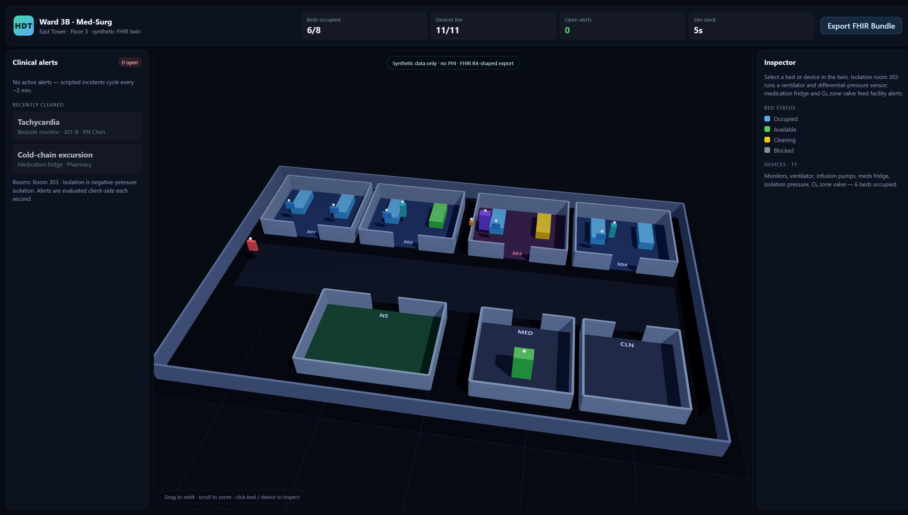

# Healthcare Digital Twin · Ward 3B

Interactive **hospital ward 3D digital twin** for a med-surg floor: live (simulated)
medical-device telemetry, clinical alert closed-loop, bed occupancy, and a **FHIR R4-shaped**
export. Built for portfolio / interview demos — **synthetic data only, no PHI**.

 



## Why this exists

Healthcare digital-twin product interviews expect:

- WebGL / React Three Fiber scene composition (not just charts)
- Data-intensive live streams and alert lifecycle
- Familiarity with clinical data shapes (FHIR Location / Device / Observation)

This repo is a focused one-ward MVP that hits those three points without a backend.

## Features

- **3D ward** — procedural floor plan, instanced beds & walls, orbit camera with fly-to
- **11 devices** — monitors, ventilator, infusion pumps, meds fridge, isolation differential
  pressure, O₂ zone valve
- **1 Hz simulator** — deterministic baselines + scripted incidents in the first ~2 minutes
  (SpO₂ drop, cold-chain excursion, isolation pressure loss, O₂ dip, infusion nearly empty)
- **Alert engine** — raise → acknowledge → clear when the condition recovers
- **FHIR R4-shaped Bundle** export (downloadable JSON) with LOINC codes where available
- **Static deploy** — Cloudflare Workers Assets (`wrangler.jsonc`), no server required

## Quick start

```bash
npm install
npm run dev          # http://127.0.0.1:3100
npm test
npm run build
npm run deploy       # build + wrangler deploy (requires wrangler login)
```

Cloudflare Workers Builds: build command `npm run build`, deploy command `npx wrangler deploy`.

## Demo script (2 minutes)

1. Open the twin — beds colour-coded by occupancy; devices pulse when alarming.
2. Wait ~20s — isolation monitor **303-A** SpO₂ drops; alert appears; click **Fly to**.
3. **Acknowledge** the alert; when SpO₂ recovers, state moves to cleared.
4. Click **Export FHIR Bundle** and open the JSON — `Location`, `Device`, `Observation`.

## Architecture

```
src/
  domain/     ward layout, metrics, FHIR code systems
  sim/        telemetry model + alert state machine + engine
  fhir/       Bundle builder / download
  scene/      R3F canvas (architecture, devices, camera rig)
  ui/         top KPI bar, alert panel, inspector
```

All telemetry and alerts run in the browser (`src/sim/engine.ts`). Refreshing the page
restarts the scenario clock; acknowledging alerts is in-memory only.

## Relation to Industrial Monitoring Center

Same engineering patterns as the workshop twin (R3F heat shader / live WS / alarm closed-loop),
re-skinned for a clinical ward with FHIR-shaped resources instead of MQTT/Timescale.

## Disclaimer

Synthetic demo. Device models, serials and staff names are fictional. Not for clinical use.
